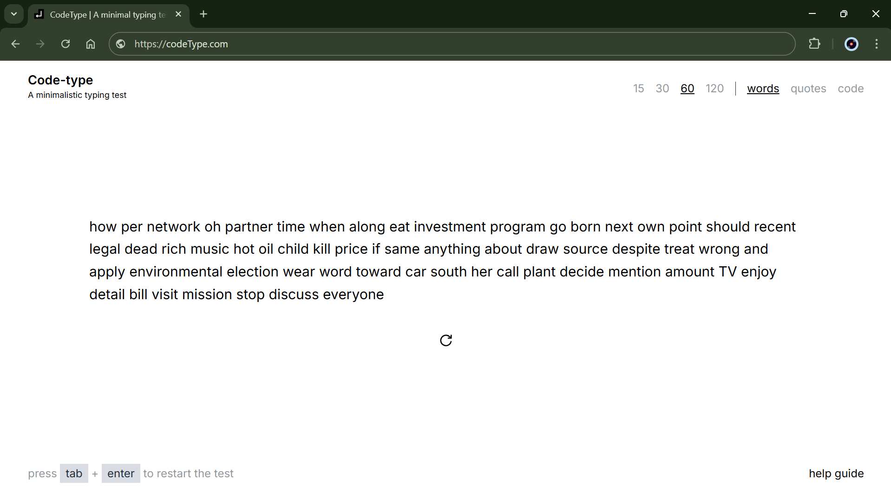

# CodeType Guide

### <a href="https://github.com/DLee1993/CodeType" target="_blank">CodeType</a> is a sleek and modern typing test website.

## Commands

### Tab

-   Pressing tab focuses on the typing game

### Enter

-   Pressing enter refreshes the current typing game text

## Features

### Numbers

-   The numbers <b>15, 30, 60, 120</b> are the different lengths of text you can choose from, by default it is <b>15</b>

### Test type

-   You have a choice of three tests <b>words, quotes or code</b> the typing game text depends on which one is selected, by default it is <b>words</b>

### Themes

-   You have a variety of themes to choose from, when a theme is selected it will become the default theme everytime you visit the website, by default it is <b>light-theme</b>

## Calculations

-   <b>WPM</b>: Total number of characters (including spaces) of words you typed correctly `{Math.round(((60 / duration) * correctChar) / 5)}`

-   <b>Accuracy</b>: Shows the percentage of characters you typed correctly `{((correctChar / text.length) * 100).toFixed(2)}%`

-   <b>Duration</b>: Total number seconds it takes a user to complete the challenge, this is calculated by react-typing-game-hook using the `start time` and `end time` states.

## Support
- If you enjoyed this game, feel free to give it a star 🌟